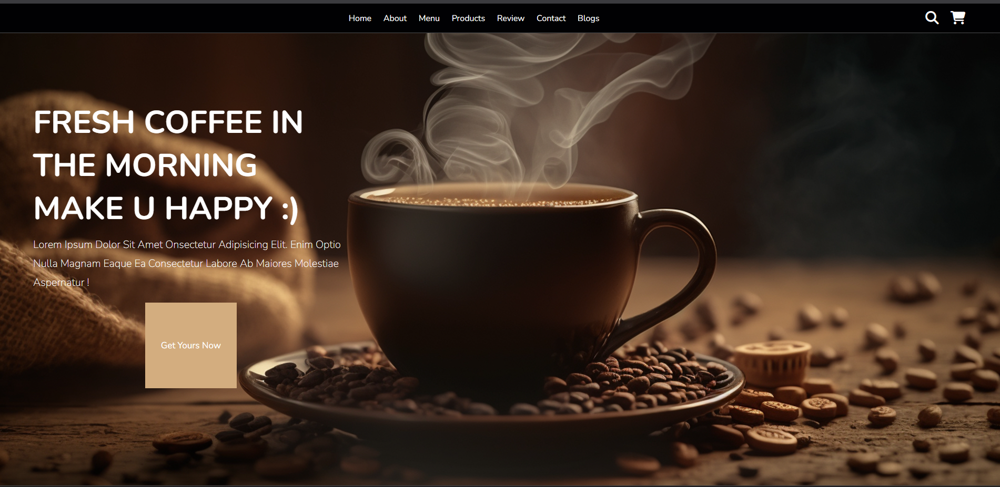

# Coffee Shop Website

This is a simple and responsive coffee shop website built using HTML, CSS, and JavaScript. It includes multiple sections like Home, About, Menu, Products, Reviews, and Contact.

## Features

- Responsive design
- Menu and product listings
- Customer reviews
- Contact form with Google Maps
- Shopping cart interface (UI only)

## Technologies Used

- HTML
- CSS
- JavaScript

## How to Use

1. Download or clone the repository.
2. Open `index.html` in your browser.

## ScreanShot

